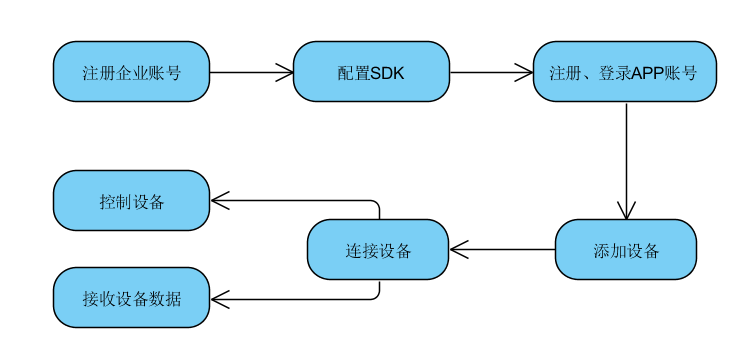
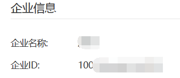
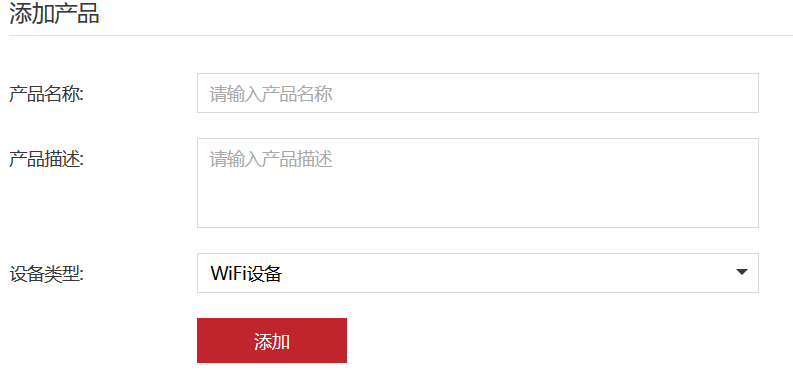
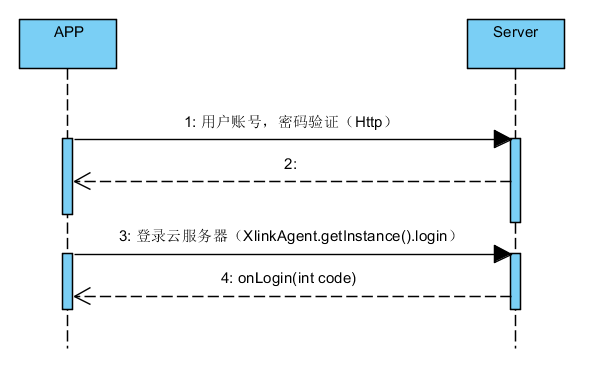
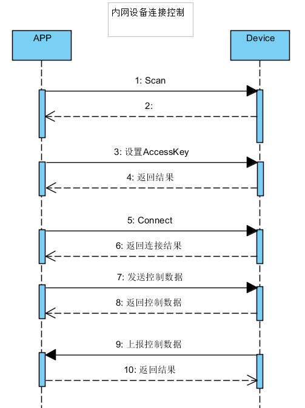
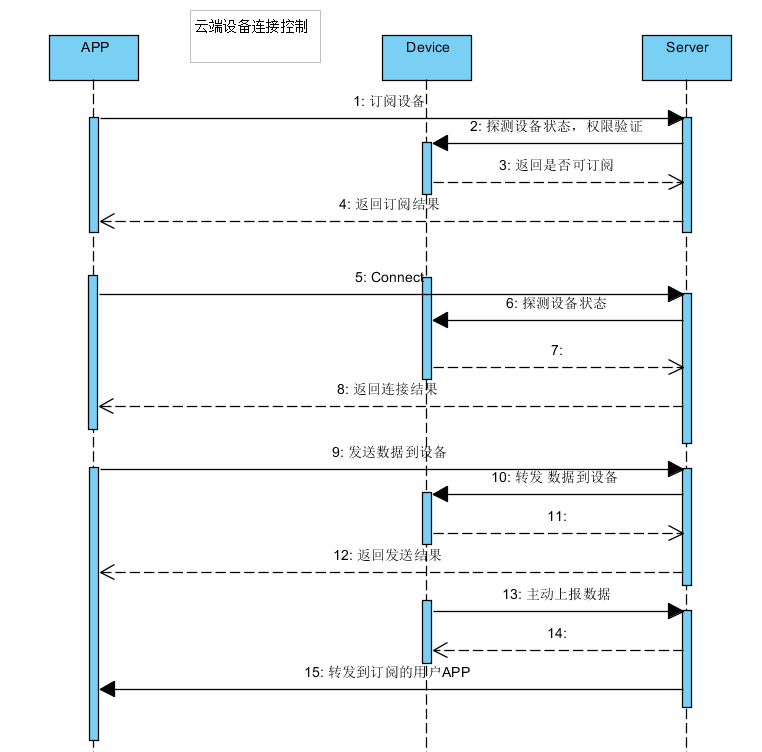

# **云智易手机APP SDK 集成指南**

[TOC]

##一、简介

- [平台简介](#Platform_Introduction)
- [APP SDK简介](#sdk_Introduction)
- [集成流程](#Integration_Processes)

### 1.1、<a name="Platform_Introduction">平台简介</a>
- 为传统企业提供物联网云平台软件服务，快速实现产品智能化、进入物联网领域
- 为企业提供技术、服务支撑平台和运营体系
- 为企业提供物联网数据服务的平台

### 1.2、<a name="sdk_Introduction">APP SDK 简介</a>

**为简化开发者的APP开发，云智易提供了APP开发套件和相关的支持服务：**
- 提供APP的SDK和开发文档，兼容iOS、Android平以及HTML5嵌入式界面
- 提供APP端通用业务功能块的实例源代码，极大简化开发人员开发工作
- 为企业用户提供专业的技术支持服务

**APP开发套件包含以下主要功能：**
- 自动扫描、发现可用设备
- 设备绑定接口
- 建立安全的本地和远程连接，以及心跳维持
- 智能链路功能，选择最优的数据通道
- 提供数据接收与发送的接口
- 提供底层网络和设备状态回调接口
- 使开发者简化APP开发流程，快速完成APP开发，开发者仅需关注APP业务功能即可，而相对复杂的协议与错误处理等事项可忽略。

### 1.3、<a name="Integration_Processes" >集成流程</a>


1. 注册企业开发者账号， 添加测试产品和设备数据端点；
2. 下载、配置APP SDK
3. 通过HTTP RESTful接口申请用户账号；
4. 通过HTTP RESTful接口进行用户账号认证，获取"user_id"、"access_token"、"refresh_token"、"authorize"；
5. 使用 "user_id"、"authorize"登录云端；
6. 添加测试设备；
7. 连接测试设备；
8. 控制设备，接收设备数据；

注：如果只需测试内网设备通信，可以跳过注册、登录用户账号以及SDK登录过程。

##二、轻松集成

- [集成准备](#ready)
- [Setp1 下载SDK](#setp1)
- [Setp2 开发环境配置](#setp2)
- [Setp3 初始化SDK](#setp3)
- [Setp4 注册、登录用户账号](#setp4)
- [Setp5 添加设备](#setp5)
- [Setp6 连接设备](#setp6)
- [Setp7 设备控制 & 接收设备数据](#setp7)

### 2.1<a name="ready" > 集成准备</a>

为了您更好的使用云智易提供的服务，使用前需要先登录企业管理后台注册企业账号，并添加产品和导入测试设备。

###2.1.1 注册企业账号
1. 打开云智易开发者网站：[http://www.xlink.cn](http://www.xlink.cn )
2. 点击免费注册按钮
3. 输入注册信息进行注册
4. 输入注册的账号，登录企业管理后台，在右上角账号信息中可以查看企业ID，==此ID在后续步骤中需要使用==。



###2.1.2 添加产品
1. 登录云智易企业管理后台：[http://admin.xlink.cn](http://admin.xlink.cn )
2. 点击左侧“添加产品”按钮
3. 输入产品信息进行添加



###2.1.3 添加设备数据端点
1. 点击企业管理后台左侧上一步添加的产品列表
2. 在概览中可以查看产品PID和产品密匙，==产品PID和产品密匙在后续步骤中需要使用==
3. 切换到数据端点标签，点击添加数据端点按钮，根据设备属性进行数据端点的添加。

###2.2  <a name="setp1" >Setp 1 下载SDK工具包</a>
1. SDK下载地址：[http://www.xlink.cn](http://www.xlink.cn )
2. 解压下载的SDK，目录结构如下图


3. 下载设备模拟器，下载地址：[http://www.xlink.cn](http://www.xlink.cn )，设备模拟器使用文档参见[http://www.xlink.cn](http://www.xlink.cn )

- 注：《透传DEMO源码》是一个使用云智易APP SDK的示例测试程序，实现了设备透传控制功能，开发者可以直接使用透传Demo进行测试体验，也可以结合本文档，参考其中Demo代码实现开发自己的APP。Demo使用文档见《透传Demo使用文档.pdf》。

- 注：为了简化Http接口调用，Android透传Demo源码中提供了HttpManage类源码供开发者使用，使用时需要替换HttpManage.COMPANY_ID为注册的企业ID。 此文档中涉及到Android Http接口的调用都以HttpManage类为例说明。

###2.3 <a name="setp2" >Setp 2 开发环境配置</a>

**Android**

1. 打开Android Studio ，点击菜单 File->New->New Project... 创建一个新的工程；
2. 把解压的 xlink-wifi-official-sdk-v2_14958.jar（具体jar名称可能有区别） 添加到工程 libs目录；
3. 在APP的build.gradle文件中添加sdk、json、http库的引用
```
 dependencies {
	compile 'com.android.support:support-v4:18.0.0'
    compile files('libs/android-async-http-1.4.6.jar')
    compile files('libs/xlink-wifi-official-sdk-v2_14958.jar')
    compile 'com.google.code.gson:gson:2.4'
}
```

**IOS**

1. 配置头文件搜索路径:进入Xcode工程属性页面，进入BuildSettings标签，找到HeaderSearchPaths选项，将libxlink/include目录加入SearchPaths；
2. 配置库引用:进入Xcode工程属性页面，进入BuildSettings标签，找到OtherLinkerFlags选项，加入-lxlinksdklib参数；
3. 配置库文件搜索路径:进入Xcode工程属性页面，进入BuildSettings标签，找到LibrarySearchPaths选项，将libxlink/lib下针对模拟器和实体机加载的库的路径配置到SearhPaths中。

###2.4 <a name="setp3" >Setp 3 初始化SDK</a>

**Android**

1. 在AndroidManifest.xml文件中application 标签下配置添加：

	**Android 代码范例**
```
	<!-- XLINK 内网服务 -->
	<service android:name="io.xlink.wifi.sdk.XlinkUdpService" />
	<!-- XLINK 公网服务 -->
	<service android:name="io.xlink.wifi.sdk.XlinkTcpService" />
```

2. 添加sdk所需要权限

	**Android 代码范例**
```
	<!-- 联网权限 -->
	<uses-permission android:name="android.permission.INTERNET" />
	<!-- 网络状态 -->
	<uses-permission android:name="android.permission.ACCESS_NETWORK_STATE" />
	<!-- wifi状态 -->
	<uses-permission android:name="android.permission.ACCESS_WIFI_STATE" />
	<!-- wifi状态改变 -->
	<uses-permission android:name="android.permission.CHANGE_WIFI_MULTICAST_STATE" />
```

3. 创建自定义Application 实现XlinkNetListener接口，并在AndroidManifest.xml中修改android:name为新建的Application

	**Android 代码范例**
```
public class MyApp extends Application implements XlinkNetListener
```
```
 <application
        android:name="io.xlink.wifi.pipe.MyApp"
        ...
 </application>
```
4. 在自定义Application 下的onCreate()函数调用XlinkAgent.init进行SDK初始化化

	**Android 代码范例**
```
// 初始化sdk
 XlinkAgent.init(this);
//参数会被长期引用，最好使用application 的 context。
```
5. 注册SDK回调监听器。至少需要注册一个监听器，可注册多个。

* 注册SDK通用监听器是为了能让APP收到来自SDK的响应事件，包含了登录、接收设备数据等回调接口。该监听器是SDK使用中十分重要的一个监听器，与SDK相关的操作都会在这里会回调，如果没有正确注册通用监听器，将无法正常使用SDK。

	**Android 代码范例**
```
//设置SDK回调监听器
XlinkAgent.getInstance().addXlinkListener(this);
//可以在该监听器中直接更新UI
```

**IOS**

1. 挂接delegate：	需要一个全局的对象作为XLINKShareObject的delegate接收器，一般情况下，我们会把App的AppDelegate作为全局delegate，如图：

	

2. 启动XLinkExportObject
	```
	[[XLinkExportObject shareObject] start];
	```
4. 编译程序
5. 若Xcode编译时没有报错误，则表示SDK初始化成功，后续便可以进行实际的开发了。

###2.5 <a name="setp4" >Setp 4 注册、登录用户账号</a>

1. **用户注册**

	可通过手机或者邮箱在云智易平台下注册成为一个云智易用户。通过账号和密码进行认证获得一个有效的调用凭证，即可通过调用凭证使用云智易用户相关的RESTful接口。
	
	**URL：/v2/user_register**
	
	[Http RESTful接口文档参见《用户身份接口》](https://github.com/xlink-corp/xlink-sdk/blob/master/%E5%BA%94%E7%94%A8%E7%AB%AF%E5%BC%80%E5%8F%91%E6%96%87%E6%A1%A3/%E5%BA%94%E7%94%A8%E7%AB%AFRESTful%E6%8E%A5%E5%8F%A3%E6%96%87%E6%A1%A3/%E7%94%A8%E6%88%B7%E8%BA%AB%E4%BB%BD%E6%8E%A5%E5%8F%A3.md)

	**注：使用邮箱注册用户后，系统会往注册的邮箱发送一封认证激活邮件，需要查看邮件并点击邮箱中的链接进行账号激活后才能正常使用账号。**

	**Android调用示例**

	**为了简化Http接口调用，Android透传Demo源码中提供了HttpManage类源码供开发者使用，使用时需要替换HttpManage.COMPANY_ID为注册的企业ID。 此文档中涉及到Android Http接口的调用如无特别说明都以HttpManage类为例说明。**


	```
	//使用邮箱注册用户，调用void registerUserByMail(String mail, String name, String pwd, final ResultCallback callback)
	
	HttpManage.getInstance().registerUserByMail(email, name, pwd, new HttpManage.ResultCallback < String > () {
            @Override
            public void onError(Header[] headers, HttpManage.Error error) {
                //注册失败
            }

            @Override
            public void onSuccess(int code, String response) {
                //注册成功，请查收邮件并激活账号
            }
        });
	```

	**IOS调用示例**
	
	**开发者需要手动将HttpRequest里面的宏定义 CorpId 后面的企业ID修改为自己企业的企业ID**
	 
	```
	+(void)registerWithAccount:(NSString *)account withNickname:(NSString *)nickname withVerifyCode:(NSString *)verifyCode withPassword:(NSString *)pwd didLoadData:(MyBlock)block;
	```

2. **用户验证**

	调用Http RESTful接口进行用户验证，需要企业ID，可在企业后台获取。 登陆与认证是用户通过账号（邮箱或者手机号）和密码获取云智易RESTful接口调用凭证的方式，成功认证后会获得一个有效的调用凭证和一个有效的刷新凭证。
    调用凭证有效期为2个小时。在凭证失效前需要调用【/v2/user/token/refresh】刷新用户凭证。

	**URL：/v2/user_auth**

	[Http RESTful接口文档参见《用户身份接口》](https://github.com/xlink-corp/xlink-sdk/blob/master/%E5%BA%94%E7%94%A8%E7%AB%AF%E5%BC%80%E5%8F%91%E6%96%87%E6%A1%A3/%E5%BA%94%E7%94%A8%E7%AB%AFRESTful%E6%8E%A5%E5%8F%A3%E6%96%87%E6%A1%A3/%E7%94%A8%E6%88%B7%E8%BA%AB%E4%BB%BD%E6%8E%A5%E5%8F%A3.md)

	

	**Android 调用示例**
	
	```
	//HttpManage.java 封装了此Http调用
    void login(String mail, String pwd, final ResultCallback callback)

    HttpManage.getInstance().login(user, pwd, new HttpManage.ResultCallback< String >() {
            @Override
            public void onError(Header[] headers, HttpManage.Error error) {
              //用户验证失败， 错误码提示见 </a>《错误码说明》 </a>文档
            }

            @Override
            public void onSuccess(int code, String response) {
                //验证成功， 解析返回的 JSON 获取"user_id"、"access_token"、"refresh_token"、"authorize"并保存
            }
        });
	```
	
	**IOS 调用示例**
	
	```
	+(void)authWithAccount:(NSString *)account withPassword:(NSString *)pwd didLoadData:(MyBlock)block;
	```

3. **登录SDK**

	用户验证成功后，需要使用“user_id”和“authorize”调用SDK登录函数登录云端后才能使用远程设备连接、控制功能。否则只能使用内网服务。

	**Android  调用示例**
```
    //启用内网服务， 设备发现，设置AccessKey等依赖此服务
     XlinkAgent.getInstance().start();
```
```
    //登录SDK 启用云端远程服务
    XlinkAgent.getInstance().login(appid, authKey);
    //返回值 int  code ：见附录
    //登录结果通过注册的监听器onLogin（int code）方法返回。
```
```
    // 回调登录xlink状态
    @Override
    public void onLogin(int code) {
        if (code == XlinkCode.SUCCEED) {
            XlinkUtils.shortTips("云端网络已可用");
        } else if (code == XlinkCode.CLOUD_CONNECT_NO_NETWORK|| XlinkUtils.isConnected()) {
            XlinkUtils.shortTips("网络不可用，请检查网络连接");
        } else {
            XlinkUtils.shortTips("连接到服务器失败，请检查网络连接");
        }
    }
```

	**IOS 调用示例**
	
	```
	//登录函数
	-(int)loginWithAppID:(int)appId andAuthStr:(NSString *)authStr;
	
	//回调函数
	-(void)onLogin:(int)result;
	```

###2.6 <a name="setp5" >Setp 5 添加设备</a>

SDK封装了内网发现功能，可以使用SDK方法扫描发现内网连接的设备，并加入到SDK中。 也可以通过网络获取设备的必要参数，通过Json转成设备实体并添加到SDK中。 只有把设备对象添加到SDK中并初始化设备，才能进行设备的连接、控制等操作。

下面以云智易提供的设备模拟器模拟一个内网设备，并进行内网发现添加到APP。
**实际项目如果使用Wifi模块进行开发，扫描设备之前需要先将设备配置Wifi连上路由器，具体配置方式请根据模块厂商提供的资料和SDK进行。**

1. 设备模拟器操作 （具体操作请查看《设备模拟器操作指南》）
	1.打开下载的设备模拟器。
	2.添加一个虚拟测试设备，设备PID和Key请在企业管理台查看。
	3.打开设备电源
	4.确保电脑网络与手机处以同一个局域网中。

2. 内网发现设备

	**Android  调用示例**

	```
	//根据PID扫描内网设备，只有PID相同的内网设备才能被发现。 PID请登录企业管理台查看
	int ret = XlinkAgent.getInstance().scanDeviceByProductId(Constant.PRODUCTID, scanListener);
	if (ret < 0) {
		//返回小于0 表示扫描失败， 具体错误码参见API文档附录
	}
	```
	```
	//扫描监听器回调
	private ScanDeviceListener scanListener = new ScanDeviceListener() {
	@Override
	public void onGotDeviceByScan(XDevice device) {
             /**
              1.device即为发现的设备对象，可添加在设备列表进行UI显示。
            	 其后所有的设备操作都是基于此对象，可保持到内存或者数据库，供后面使用。
			 2.发现设备成功， 每发现一次就会回调一次，这里注意状态判断，避免Acitivity已销毁再回调的异常。
             3.监听器内部尽量不要进行费时的UI操作
            */
    };

    使用内网发现功能扫描设备会自动将发现的设备加入到SDK并初始化， 如果通过Json等方式添加设备，还需要调用SDK的 XlinkAgent.getInstance().initDevice(xDevice)进行初始化到SDK中。
	```
	**IOS 调用示例**
	
	```
	//扫描函数
	-(int)scanByDeviceProductID:(NSString *)productID;
	
	//回调函数，没扫描到一个设备都会回调一次
	-(void)onGotDeviceByScan:(DeviceEntity *)device;
	```

###2.7 <a name="setp6" >Setp 6 连接设备</a>
1. 连接设备用于探测设备状态，并与之建立网络通道。外网连接需要先订阅设备（SDK内部会自动订阅，如果连接返回设备订阅关系错误如设备重置过AccessKey等情况，则需要手动调用订阅方法进行订阅）。
SKD会根据网络连接情况自适应内外网络环境，会自动选择速度快的网络进行设备连接。

	
	

	**Android  调用示例**

	```
	//根据上一步内网发现的设备，使用AccesKey进行设备连接 如设备未设置AccessKey，连接前需要先进行AccessKey设置。
    int ret = XlinkAgent.getInstance().connectDevice(device.getXDevice(),device.getAccessKey(), connectDeviceListener);
        if (ret < 0) {// 调用设备失败
            //返回小于0 表示扫描失败， 具体错误码参见API文档附录
        }
```
```
    //根据上一步内网发现的设备，使用AccesKey进行设备连接 如设备未设置AccessKey，连接前需要先进行AccessKey设置。
    //需要在同一个局域网并且设备未设置AccssKey才能设置成功
	XlinkAgent.getInstance().setDeviceAccessKey(device, key, new SetDeviceAccessKeyListener() {
         @Override
         public void onSetLocalDeviceAccessKey(XDevice device, int code, int messageId) {
             Log("设置AccessKey:" + code);
             switch (code) {
                 case XlinkCode.SUCCEED:
                 	//设置成功
                     break;
             }
         }
     });
	```
	```
	 /**
     * 连接设备回调。该回调在主程序，可直接更改ui
     */
    private ConnectDeviceListener connectDeviceListener = new ConnectDeviceListener() {

        @Override
        public void onConnectDevice(XDevice xDevice, int result) {

            switch (result) {
                case XlinkCode.DEVICE_STATE_LOCAL_LINK:
                	 // 连接设备成功 设备处于内网
                    break;
                case XlinkCode.DEVICE_STATE_OUTER_LINK:
                	// 连接设备成功 设备处于云端
                	break;
                case XlinkCode.CONNECT_DEVICE_INVALID_KEY:
                	// 设备授权码错误
                    break;
                case XlinkCode.CONNECT_DEVICE_OFFLINE:
                   // 设备不在线
                    break;
                case XlinkCode.CONNECT_DEVICE_TIMEOUT:
                // 连接设备超时了，（设备未应答，或者服务器未应答）
                    break;
                case XlinkCode.CONNECT_DEVICE_SERVER_ERROR:
                    break;
                case XlinkCode.CONNECT_DEVICE_OFFLINE_NO_LOGIN:
                    //连接设备失败，设备未在局域网内，且当前手机只有局域网环境"
                    break;
                default:
                    break;
            }

        }
	```
	
	**IOS 调用示例**
	
	```
	//连接设备函数
	-(void)onGotDeviceByScan:(DeviceEntity *)device;
	
	//回调函数
	-(void)onConnectDevice:(DeviceEntity *)device andResult:(int)result andTaskID:(int)taskID ;
	
	//设备的连接状态在device的属性里面
	//isConnected;  设备是否连接上
	//isConnecting; 设备是否正在连接
	//isLANOnline;  局域网是否在线
	//isWANOnline;  广域网是否在线
	```
	
###2.8 <a name="setp7" >Setp 7 设备控制&接收设备数据</a>

1. 设备连接成功后，即可对设备进行控制和获取设备的属性等信息。 设备控制可通过透传数据包，或者设置设备属性（数据端点）等方式。
SDK

	**Android  调用示例**

	```
//需要连接成功后才能发送数据，SDK和云端将发送的数据透传到设备端
int ret = XlinkAgent.getInstance().sendPipeData(device.getXDevice(), data, pipeListener);
        if (ret < 0) {
            switch (ret) {
                case XlinkCode.NO_CONNECT_SERVER:
                    Log("发送数据失败，手机未连接服务器");
                    break;
                case XlinkCode.NETWORD_UNAVAILABLE:
                    Log("当前网络不可用,发送数据失败");
                    break;
                case XlinkCode.NO_DEVICE:
                    Log("未找到设备");
                    XlinkAgent.getInstance().initDevice(device.getXDevice());
                    break;
                default:
                    Log("发送数据失败，错误码：" + ret);
                    break;
            }
        } else {
              //发送数据成功
        }
	```
	```
   //发送成功后再收到设备相应时回回调
    private SendPipeListener pipeListener = new SendPipeListener() {

        @Override
        public void onSendLocalPipeData(XDevice device, int code, int messageId) {
            // setDeviceStatus(false);
            switch (code) {
                case XlinkCode.SUCCEED:
                    Log("发送数据,msgId:" + messageId + "成功");
                    break;
                case XlinkCode.TIMEOUT:
                    // 重新调用connect
                    Log("发送数据,msgId:" + messageId + "超时");
                    break;
                case XlinkCode.SERVER_CODE_UNAUTHORIZED:
                    XlinkUtils.shortTips("控制设备失败,当前帐号未订阅此设备，请重新订阅");
                    //订阅关系失败，请调用订阅函数后重新连接
                    connectDevice();
                    break;
                case XlinkCode.SERVER_DEVICE_OFFLIEN:
                    Log("设备不在线");
                    break;
                default:
                    Log("控制设备其他错误码:" + code);
                    break;
            }
        }
    };
	```
	
	**IOS 调用示例**
	
	```
	//局域网发包函数
	-(int)sendLocalPipeData:(DeviceEntity *)device andPayload:(NSData *)payload;
	
	//云端发包函数
	-(int)sendPipeData:(DeviceEntity *)device andPayload:(NSData *)payload;
	
	//局域网收包回调
	-(void)onRecvLocalPipeData:(DeviceEntity *)device withPayload:(NSData *)data;
	
	//云端收包回调
	-(void)onRecvPipeData:(DeviceEntity *)device withPayload:(NSData *)payload;
	```


##三、API文档

### 3.1 概述

云智易App sdk 帮助开发者基于android、iOS系统上开发App和xlink模块智能设备进行设备管理和通讯。
SKD封装的过程包括设备发现、连接、控制、心跳、状态上报、推送报警、通知等。
使用SDK可以简化开发者接入云智易物联网平台的开发工作量，专注企业业务功能的开发。

### 3.2 接口介绍
APP接口分为三大部分
- Android SDK  封装用于Android开发环境和Android系统的设备管理和设备通讯功能接口。
- iOS SDK 封装用于XCODE开发环境和iOS系统的设备管理和设备通讯功能接口。
- Http RESTful接口 用于设备订阅、设备分享、设备权限管理、数据存储等设备通讯之外的其他云端服务。为了简化Http接口调用，Android透传Demo源码中提供了HttpManage类供开发者使用，需要替换HttpManage.COMPANY_ID为注册的企业ID。

#### 3.2.1 Android SDK功能函数：

_ _ _

##### void init(Context mContext)
**方法说明：**

* 初始化xlink sdk,使用sdk前，必须调用

**参数：**

| 参数 | 说明 |
| --- | --- |
|mContext | ApplicationContext实例，参数会持续引用|

_ _ _

##### int start()

**方法说明：**

* 启动内网服务，绑定udp 如第一次使用 需要连接到和wifi设备同一局域网
* 该链接会自己重连维护
* 如果不使用局域网功能，该方法可以不调用（可判断是否是移动网络）

**返回值：**

| 值 | 说明 |
| --- | --- |
| = 0 | 调用成功
| < 0 | 调用失败,失败code请观看同步错误码;

**对应回调:**

	XlinkNetListener.onStart(int code)

>详情请参见XlinkNetListener说明

_ _ _

##### int login(int user_id, String access_token)

**方法说明：**

* 使用user_id和access_token登录到CM服务器。user_id和access_token的获取，请查看demo代码及用户HTTP接口开发文档 
* 获取到的user_id和access_token，由外部APP缓存维护。
* 该方法不用重复调用，调用一次后，会自己断线重连
* 只有login成功后，才能使用跟云端有关的服务

**参数：**

| 参数 | 说明 |
| --- | --- |
| user_id | 通过HTTP接口获取到的连接云端的用户ID |
| access_token | 连接云端认证码 |

**返回值：**

| 值 | 说明 |
| --- | --- |
| = 0 | 调用成功
| < 0 | 调用失败,失败code请观看同步错误码;

**对应回调:**

	XlinkNetListener.onLogin(int code)

>详情请参见XlinkNetListener 说明

_ _ _

##### boolean initDevice(XDevice device)

**方法说明：**

* 向SDK中初始化设备节点
* APP可以缓存设备节点，在下次程序启动后，可以自行初始化设备节点到SDK，用于跳过Scan步骤。
* SDK把设备节点放入内部队列，用于设备的定位和回调时的参数。
* 初始化设备时SDK不要向设备发送任何消息包，包括handshake。

**参数：**

| 参数 | 说明 |
| --- | --- |
|XDevice | Device实体对象|

**返回值：**

| 值 | 说明 |
| --- | --- |
|true  | 向SDK添加设备成功
|false | 添加设备失败，设备属性错误


_ _ _


##### XDevice JsonToDevice(JSONObject jsonObject)

**方法说明：**

* 把jsonObject 序列化成Xdevice对象（除了scan，是获取XDevice实例的唯一接口）

**参数：**

| 参数 | 说明 |
| --- | --- |
|jsonObject | 设备的json对象

**返回值：**

| 值 | 说明 |
| --- | --- |
|XDevice | 序列化成功后的Device对象
|NULL | jsonObject错误

_ _ _

##### JSONObject   deviceToJson(XDevice device)

**方法说明：**

* 如果需要存储设备，通过此接口把device序列话成JSONObject对象，然后存储

**参数：**

| 参数 | 说明 |
| --- | --- |
|device | XDevice实例

_ _ _

##### void  stop()

**方法说明：**

* 停止SDK，释放SDK所有占用的资源,在APP退出,或者不再使用SDK时调用。
* 该函数会清空initDevice()后设备列表;
* 清空addXlinkNetListener监听器列表；

_ _ _

##### void addXlinkListener(XlinkNetListener listener)

**方法说明：**

* 添加XlinkNetListener 监听器，请确保全局至少有一个监听器。
_ _ _

##### void debug(boolean debug)

**方法说明：**

* 设置日志是否打印

_ _ _

##### boolean isConnectedOuterNet()

**方法说明：**

* 判断是否连接上xlink服务器

**返回值：**

| 值 | 说明 |
| --- | --- |
|true | 已连接
|false | 未连接

_ _ _


##### boolean isConnectedLocal()

**方法说明：**

* 判断sdk 是否启动本地内网服务

**返回值：**

| 值 | 说明 |
| --- | --- |
|true | 启用|
|false | 未启用|

_ _ _

#### 3.2.2 Android 设备操作函数


##### int scanDeviceByProductID(String productId,ScanDeviceListener listener)

**方法说明：**

* 通过productid扫描内网内所有对应的设备;需开启wifi 并连接到设备所在的wifi网络

** 参数：**

| 参数 | 说明 |
| --- | --- |
|productid | 设备的产品id|
|ScanDeviceListener | listener 监听器|

** 返回值：**

| 值 | 说明 |
| --- | --- |
| = 0 | 调用成功|
| < 0 | 调用失败,失败code参见 同步错误码|

** 对应回调:**

   	ScanDeviceListener.onGotDeviceByScan(XDevice device)
在扫描回调中, 可以通过device.getAccessKey()属性判断设备是否已设置设备授权码, 如果没设置,需要设置一下. 后面的用户通过判断是否设置AccessKey以及AccessKey是否一致,来控制是否需要把此设备添加到APP中


_ _ _


##### int setDeviceAccessKey(XDevice device, final int accessKey, final SetDeviceAccessKeyListener listener)

**方法说明：**

* 修改设备密码(授权码)，必须在内网环境才能设置
* 已经设置过AccessKey的设备需要硬件复位清除AccessKey后才能重新设置

** 参数：**

| 参数 | 说明 |
| --- | --- |
| XDevice | Device实体对象
| accessKey | 设备密码(授权码) 支持9位数字
| listener | 监听器

** 返回值：**

| 值 | 说明 |
| --- | --- |
| = 0 | 调用成功 |
| < 0 | 调用失败,失败code参见 同步错误码 |

** 结果回调：**

	SetDeviceAccessKeyListener.onSetLocalDeviceAccessKey(XDevice device, int code, int messageId)


_ _ _

#####  int connectDevice(XDevice device,final int accessKey, ConnectDeviceListener connectListener)

**方法说明：**

* 调用该函数用于连接设备，确定设备处于内网还是外网;

**参数：**

| 参数 | 说明 |
| --- | --- |
| XDevice | Device实体兑现 | 
| accessKey | 设备授权码 | 
| connectListener | 监听器 | 

** 返回值：**

| 值 | 说明 |
| --- | --- |
| = 0 | 调用成功 |
| < 0 | 调用失败,失败code参见 同步错误码 |

** 结果回调：**

    ConnectDeviceListener.onConnectDevice(XDevice xDeivce, int ret)

_ _ _


##### int setDataPoint(XDevice xdevice, List< DataPiont > dataPionts,SetDataPointListener listener)

**方法说明：**

* 设置设备的数据端点

**参数：**

| 参数 | 说明 |
| --- | --- |
| xdevice| XDevice实体对象
| dataPionts | 需要设置的数据端点列表|

** 返回值：**

| 值 | 说明 |
| --- | --- |
| = 0 | 调用成功 |
| < 0 | 调用失败,失败code参见 同步错误码 |

** 结果回调：**

	SetDataPointListener.onSetDataPoint();

_ _ _


##### int subscribeDevice(XDevice device, int accessKey, SubscribeDeviceListener listener)

** 方法说明：**

* 订阅设备(必须有公网环境)(如果在公网环境下使用
* 公网环境调用 XlinkAgent.getInstance().getconnectDevice()会自动调用该函数;
* 设备端重置设备密码后，订阅关系会清空
* 解除订阅关系请调用HTTP接口(/v2/user/{user_id}/unsubscribe) 参考:[http://support.xlink.cn/hc/kb/article/89925/](http://support.xlink.cn/hc/kb/article/89925/)

**参数：**

| 参数 | 说明 |
| --- | --- |
| DeviceObject | Device实体对象
| accessKey | 设备授权码
| listener | 监听器

** 返回值：**

| 值 | 说明 |
| --- | --- |
| = 0 | 调用成功；
| < 0 | app本地错误;详情参见同步错误码;

** 结果回调：**

	onSubscribeDevice()


_ _ _

##### int sendPipeData(XDevice device, byte[] data, SendPipeListener listener)

**方法说明：**

* 向设备发送pipe数据包.

** 参数：**

| 参数 | 说明 |
| --- | --- |
| DeviceObject | Device实体对象
| byte[] | Pipe数据

** 返回值：**

| 值 | 说明 |
| --- | --- |
| = 0 | 调用成功；
| < 0 | app本地错误;详情参见同步错误码;


** 结果回调：**

	onSendPipeData

#### 3.2.3 XlinkNetListener 回调说明：

##### onStart(int code)

**方法说明：**

* 调用XlinkAgent.start()的回调

**返回值：**

XlinkCode常量 | int实际值 | 说明
---- | ---- | ----
`SUCCEED`|0|成功
`LOCAL_CONNECT_ERROR`	|-1	|绑定端口失败
...|...|...

##### onLogin(int code)

**方法说明：**

* 调用XlinkAgent.login的回调(如果已经login 服务器成功，是不会再回调该函数)

**返回值：**

XlinkCode 常量|int实际值|说明|
---- | ---- | ---- |
SUCCEED|0|登录服务器成功|
CLOUD_CONNECT_ERROR`|-1|连接公网服务器失败（解析域名失败/无网络连接/网络响应超时）
CLOUD_CONNECT_NO_NETWORK`|-2|无物理网络连接
TIMEOUT`|-100|登录服务器超时（原因：手机网络不稳定)
SERVER_CODE_INVALID_PARAM`|1|参数错误（sdk内部错误）
SERVER_CODE_INVALID_KEY`|2|app key不正确
SERVER_CODE_UNAVAILABLE_ID`|3|非法的 appid
SERVER_CODE_SERVER_ERROR`|4|服务器内部错误
... | ...	| ...

##### onDisconnect(int code)

**方法说明：**

* 对应于login，当app从xlink服务掉线时，会回调该方法。云端连接会自己断线重连(网络异常，心跳异常才会，其他异常需要处理)，不用重复调用Login()方法

**返回值:**
XlinkCode 常量|int实际值|说明
---- | ---- | ----
CLOUD_STATE_DISCONNECT`|-1|网络问题导致和服务器连接中端(不需要处理，会自动重连)
CLOUD_KEEPALIVE_ERROR`|-2|和服务器心跳异常，导致从服务器掉线(不需要处理，会自动重连)
CLOUD_SERVICE_KILL`|-3|XlinkTcpServrce服务被异常杀死（如360等安全软件）.（需要重新调用login函数）
CLOUD_USER_EXTRUSION`|-4|该用户在其他地方登录(提示用户，帐号被挤)


##### onLocalDisconnect(int code);

**方法说明：**

* 本地服务断开

**返回值：**
XlinkCode 常量|int实际值|说明
---- | ---- | ----
`LOCAL_THREAD_ERROR`|-1|无物理网络
`LOCAL_SERVICE_KILL`|-2|XlinkUdpServrce服务被异常杀死（如360等安全软件),需要重新调用start函数。
...|...|...

##### onRecvPipeData(XDevice device, byte flags, byte[] data);

**方法说明：**

* 收到局域网内设备推送的pipe数据 （跟设备直连，返回的数据）

**参数 :**

| 参数 | 说明 |
| --- | --- |
| device | 设备实体
|flags|标识|
| data | byte数据

##### onRecvPipeSyncData(XDevice device, byte flags, byte[] data);

**方法说明：**

* 收到服务器推送的同步pipe数据

**参数 :**

| 参数 | 说明 |
| --- | --- |
| device | 该设备的 pipe数据
|flags|标识|
| data | byte数据

##### onDataPointUpdate(XDevice xDevice, List < DataPiont > dataPionts);

**方法说明：**

* 设备数据节点发生改变，会回调此方法

**参数 :**

| 参数 | 说明 |
| --- | --- |
| device | 设备实例
| dataPionts | 数据端点


type 定义|具体int值|说明
---- | ---- | ----
`POINT_TYPE_BOOLEAN`|1|布尔值
`POINT_TYPE_BYTE`|2|byte单字节
`POINT_TYPE_SHORT`|3|int16 (short)
`POINT_TYPE_INT`|4|int32 (int)
`POINT_TYPE_STRING`|5|string


##### onDeviceStateChanged(XDevice xdevice, int state);

**方法说明：**

* 设备当连接成功/掉线，如果设备有状态变化会回调该方法.
* 每当设备掉线，会自动调用connectDevice 一次。

**参数 :**

| 参数 | 说明 |
| --- | --- |
| device | 设备实例
| state | 状态

state 定义 | int实际值 |	说明
-----|-----|-----
`DEVICE_CHANGED_CONNECTING`|	-1|	设备重新连接中
`DEVICE_CHANGED_OFFLINE`|	-2|	设备掉线
`DEVICE_CHANGED_CONNECT_SUCCEED`|	-3|	设备重新连接成功
...|	...|	...

##### onEventNotify(EventNotify eventNotify);

**方法说明：**

* 设备、云端通知、告警回调。 告警通知详细文档请参考[《告警服务接口》](https://github.com/xlink-corp/xlink-sdk/blob/master/%E7%89%A9%E8%81%94%E5%B9%B3%E5%8F%B0%E7%AE%A1%E7%90%86%E6%8E%A5%E5%8F%A3%E6%96%87%E6%A1%A3/%E5%91%8A%E8%AD%A6%E6%9C%8D%E5%8A%A1%E6%8E%A5%E5%8F%A3.md)

**参数 :**

| 参数 | 说明 |
| --- | --- |
| eventNotify | EventNotify对象实例

* EventNotify:
  * notyfyFlags:
     * bit0:来自server的事件
     * bit1:来自其他device的事件
     * bit2:来自其他APP的事件
     * bit3:收到事件后要不要应答, 默认都不需要应答
     * bit4-7:预留 Reserved
 * formId :发送者ID 如果是服务端发送的消息, id为0
	 * messageType:
 	    * 1:设备端点变化发送的通知
    	* 2:设备端点变化引起的警报
    	* 3:设备管理员推送的分享消息
     	* 4:厂商推送的消息广播
     	* 5:设备属性变化通知
  * 当 messageType=1 or 2 时,
     * notifyData: 前2个字节为字符串长度,后面的所有数据为UTF8格式的字符串


#### 3.2.2 IOS SDK 功能函数
##### 1. 启动SDK

```
-(int)start
```

##### 说明：

开始初始化操作监听的app本地UDP端口用于SDK监听WiFi设备数据回包，从休眠恢复之后，需要再次调用stop和start

##### 参数：

* 无

##### 返回值：

| 值 | 说明 |
| --- | --- |
| 0 | 成功 |
| 其他 | 失败 |

##### 2. 初始化设备

```
-(int)initDevice:(DeviceEntity*)device;
```

##### 说明：

* 初始化（更新）某个设备的基本信息，用在从APP缓存设置到SDK中时使用。

##### 参数：

| 参数 | 说明 |
| --- | --- |
device | 设备实体

##### 返回值：

| 值 | 说明 |
| --- | --- |
0 | 成功
其它 | 失败

备注：

##### 3. 连接到云端

##### 函数： 

	-(int)loginWithAppID:(int)appId andAuthStr:(NSString*)authStr;

##### 说明：

* APP登录到云端，登录到云端以后，才可以使用云端的功能。

##### 参数：

| 参数 | 说明 |
| --- | --- |
| appId | 云端分配的唯一APPID，通过HTTP接口注册获取到。|
| authStr | 云端分配的唯一APPID对应的AuthKey，通过HTTP接口注册获取到。|

返回值：

| 值 | 说明 |
| --- | --- |
| 0 | 成功 |
| 其他 | 失败 |

##### 4. 通过产品ID扫描设备

```
-(int)scanByDeviceProductID:(NSString*)productID;
```

##### 说明：

* 通过产品ID扫描本地内网设备

##### 参数：
| 参数 | 说明 |
| --- | --- |
| productID | 产品ID |

##### 返回值：

| 值 | 说明 |
| --- | --- |
| 0 | 成功 |
| 其他 | 失败 |

> 扫描结果通过onGotDeviceByScan异步返回。

##### 5. 通过本地通讯设置设备授权码(v2版本使用)

##### 函数：

```
-(int)setAccessKey:(NSNumber *)accessKey withDevice:(DeviceEntity *)device;
```

##### 说明：

* 设置内网中设备的授权码，仅能设置初始化状态（没有被设置过授权码）下的设备

##### 参数：

| 参数 | 说明 |
| --- | --- |
| accessKey | 授权码(9位纯数字) |
| device | 设备实体 |

##### 返回值：

| 值 | 说明 |
| --- | --- |
| 0 | 成功 |
| 其它 | 失败 |

>设置结果通过onSetDeviceAccessKey返回。

##### 5. 通过本地通讯设置设备授权码(v2版本已淘汰)

##### 函数：

```
-(int)setLocalDeviceAuthorizeCode:(DeviceEntity*)device andOldAuthCode:(NSString*)oldAuth andNewAuthCode:(NSString*)newAuth;
```

##### 说明：

* 设置内网中设备的授权码

##### 参数：

| 参数 | 说明 |
| --- | --- |
| device | 设备实体 |
| oldAuth | 旧密码，如果设备本身并没有设置授权码的话，该参数置为@"" |
| newAuth | 新密码 |

##### 返回值：

| 值 | 说明 |
| --- | --- |
| 0 | 成功 |
| 其它 | 失败 |

>设置结果通过onSetLocalDeviceAuthorizeCode返回。

##### 6. 通过云端设置设备授权码(v2版本已淘汰)

##### 函数：

```
-(int)setDeviceAuthorizeCode:(DeviceEntity*)device andOldAuthKey:(NSString*)oldAuth andNewAuthKey:(NSString*)newAuth;
```

##### 说明：

* 通过云端设置设备的授权码

##### 参数：

| 参数 | 说明 |
| --- | --- |
| device | 设备实体;
| oldAuth | 旧密码，如果设备本身并没有设置授权码的话，该参数置为@"";
| newAuth | 新密码; 

##### 返回值：

| 值 | 说明 |
| --- | --- |
| 0 | 成功; |
| 其它 | 失败; |

> 设置结果通过onSetDeviceAuthorizeCode返回

##### 7. 连接一个设备

##### 函数：

```
 -(int)connectDevice:(DeviceEntity *)device andAuthKey:(NSNumber *)authKey;
```
##### 说明：

* 控制设备之前，先要去连接设备；
* 该函数会自动识别设备是本地可用还是云端可用；

参数：

	device设备实体;
	authKey设备授权码;

返回值：

	0成功;
	其他失败;

备注：

	连接结果通过onConnectDevice回调

##### 8.发送本地透传数据

##### 函数：

```
 -(int)sendLocalPipeData:(DeviceEntity*)device andPayload:(NSData*)payload;
```

##### 说明：

* 向内网中的设备发送透传数据

##### 参数：

| 参数 | 说明 |
| --- | --- |
device | 设备实体;
payload | 数据值，二进制的。

##### 返回值：

| 值 | 说明 |
| --- | --- |
0 | 成功
其它 | 失败

> 其发送结果通过onSendLocalPipeData回调返回。

##### 9. 通过云端发送透传数据

##### 函数：

```
-(int)sendPipeData:(DeviceEntity*)device andPayload:(NSData*)payload;
```

##### 说明：

* 通过云向设备发送透传数据

##### 参数：

| 参数 | 说明 |
| --- | --- |
device | 设备实体
payload | 数据值，二进制的

##### 返回值：
| 值 | 说明 |
| --- | --- |
0 | 成功
其它 | 失败

> 其发送结果通过onSendLocalPipeData回调返回。

##### 10. 探测云端设备状态

##### 函数：

```
 -(int)probeDevice:(DeviceEntity*)device;
```

##### 说明：

* 探测设备状态

##### 参数：

| 参数 | 说明 |
| --- | --- |
device ｜ 设备实体

##### 返回值：

| 值 | 说明 |
| --- | --- |
0 | 成功
其他 | 失败
>探测结果异步通过onDeviceProbe回调

##### 11. 获取SDK中所有设备列表

##### 函数：

```
 -(NSArray*)getAllDevice;
```

##### 说明：

* 得到所有缓存的设备列表，返回的NSArray中包含的是DeviceEntity对象

##### 参数：

* 无

##### 返回值：

| 值 | 说明 |
| --- | --- |
NSArray | DeviceEntity * 实体的队列

##### 12. 释放SDK

##### 函数：

```
-(void)stop;
```

##### 说明：

* 释放SDK，清理本地资源。在退出程序，或者从休眠恢复之后，都需要再次调用stop和start

##### 参数：

* 无

返回值：

* 无

#### 3.2.3 XLinkExportObjectDelegate代理回调说明
##### 1. onStart
##### 定义：

```
-(void)onStart;
```

##### 说明：

* SDK的start接口结果回调

参数：

* 无

##### 2. onLogin

##### 函数：

```
-(void)onLogin:(int)result;
```

##### 说明：

* 登录状态回调

参数：

* 无

result结果：

| 定义 | 值 | 说明 |
| --- | --- | --- |
`CODE_SUCCEED` | 0 | 登录成功;
`CODE_SERVER_KICK_DISCONNECT` | 13 | 被踢下线;
`CODE_STATE_OFFLINE` | -101 | 与服务器socket连接断开;

##### 3. onGotDeviceByScan

##### 函数：

```
-(void)onGotDeviceByScan:(DeviceEntity*)device;
```

##### 说明：

* SDK扫描到的设备结果回调;

##### 参数：

| 参数 | 说明 |
| --- | --- |
device | 设备实体 

> 如果扫描到了多个设备，该回调会多次调用;

##### 4. onSetDeviceAccessKey(v2版本使用)

##### 函数：

```
-(void)onSetDeviceAccessKey:(DeviceEntity *)device withResult:(unsigned char)result withMessageID:(unsigned short)messageID;
```

##### 说明：

* 内网中设置用户访问授权码的结果回调。

##### 参数：

| 参数 | 说明 |
| --- | --- |
| device | 设备实体;
| result | 设置结果;
| messageID | 消息ID，用于定位消息。APP可以忽略;

##### 4. onSetLocalDeviceAuthorizeCode(v2版本已淘汰)

##### 函数：

```
-(void)onSetLocalDeviceAuthorizeCode:(DeviceEntity*)device withResult:(int)result withMessageID:(int)messageID;
```

##### 说明：

* 内网中设置用户访问授权码的结果回调。

##### 参数：

| 参数 | 说明 |
| --- | --- |
| device | 设备实体;
| result | 设置结果;
| messageID | 消息ID，用于定位消息。APP可以忽略;

##### 5. onSetDeviceAuthorizeCode(v2版本已淘汰)

##### 函数：

```
-(void)onSetDeviceAuthorizeCode:(DeviceEntity*)device withResult:(int)result withMessageID:(int)messageID;
```

##### 说明：

* 云端设置授权结果回调

##### 参数：
| 参数 | 说明 |
| --- | --- |
| device | 设备实体
| result | 设置结果
| messageID | 消息ID，用于定位消息。APP可以忽略

##### 6. onSendLocalPipeData

##### 函数：

```
-(void)onSendLocalPipeData:(DeviceEntity*)device withResult:(int)result withMessageID:(int)messageID;
```

##### 说明：

* 发送本地透传消息结果回调

##### 参数：

| 参数 | 说明 |
| --- | --- |
| device | 设备实体;
| result | 设置结果;
| messageID | 消息ID，用于定位消息。APP可以忽略;

##### 7. onSendPipeData

##### 函数：

```
-(void)onSendPipeData:(DeviceEntity*)device withResult:(int)result withMessageID:(int)messageID;
```

##### 说明：

* 发送云端透传数据结果

##### 参数：

| 参数 | 说明 |
| --- | --- |
| device | 设备实体;
| result | 设置结果;
| messageID | 消息ID，用于定位消息。APP可以忽略;

##### 8. onRecvLocalPipeData

##### 函数：

```
-(void)onRecvLocalPipeData:(DeviceEntity*)device withPayload:(NSData*)data;
```

##### 说明：

* 接收到设备发送过来的透穿消息

##### 参数：

| 参数 | 说明 |
| --- | --- |
| device | 设备实体;
| data | 消息内容;

##### 9. onRecvPipeData

##### 函数：

```
-(void)onRecvPipeData:(DeviceEntity*)device withPayload:(NSData*)payload;
```

##### 说明：

* 接收到云端设备发送回来的透传数据

##### 参数：
| 参数 | 说明 |
| --- | --- |
| device | 设备实体;
| data | 消息内容;

##### 10. onRecvPipeSyncData

##### 函数：

```
-(void)onRecvPipeSyncData:(DeviceEntity*)device withPayload:(NSData*)payload;
```

##### 说明：

* 接收到云端设备发送的广播透传数据

##### 参数：

| 参数 | 说明 |
| --- | --- |
| device | 设备实体;
| data | 消息内容;

##### 11. onDeviceProbe

##### 函数：

```
-(void)onDeviceProbe:(DeviceEntity*)device withResult:(int)result withMessageID:(int)messageID;
```

##### 说明：

* 云端探测返回回调

##### 参数：

| 参数 | 说明 |
| --- | --- |
| device | 设备实体;
| result | 设置结果;
| messageID | 消息ID，用于定位消息。APP可以忽略;

##### 12. onConnectDevice

##### 函数：
```
-(void)onConnectDevice:(DeviceEntity*)device andResult:(int)result andTaskID:(int)taskID;
```
##### 说明：

* 连接设备结果回调

##### 参数：

| 参数 | 说明 |
| --- | --- |
| device | 设备实体;
| result | 设置结果;
| messageID | 消息ID，用于定位消息。APP可以忽略;

##### 13. onDeviceStateChanged

##### 函数：

````
-(void)onDeviceStatusChanged:(DeviceEntity*)device;
````

##### 说明：

* 设备上下线状态回调

##### 参数：

| 参数 | 说明 |
| --- | --- |
| device | 设备实体|

##### 14. onDataPointUpdata

##### 函数：

```
-(void)onDataPointUpdata:(DeviceEntity*)device withIndex:(int)index withDataBuff:(NSData*)dataBuff
```

##### 说明：

* 数据端点数据回调;

##### 参数：
| 参数 | 说明 |
| --- | --- |
| device | 设备实体
| index | 端点索引
| dataBuff | 索引值
| channel | 通道：云端还是本地

> 纯透传APP，该功能用不到；

#### 3.2.4 DeviceEntity属性说明代理回调说明

APP开发者只用关心几个属性即可；

##### -(BOOL)getInitStatus;

	设备是否初始化过，初始化的概念就是设备有没有被设置过授权码，如果没有就需要先设置授权码才可以使用。

##### @property (assign, nonatomic, readonly) bool isConnected; 
	设备是否连接上
	
##### @property (assign, nonatomic, readonly) bool isConnecting;
	设备是否正在连接
	
##### @property (assign, nonatomic, readonly) bool isLANOnline; 
	局域网是否在线
	
##### @property (assign, nonatomic, readonly) bool isWANOnline; 
	云端是否在线

##### -(NSDictionary*)getDictionaryFormatWithProtocol:(int)protocol;

	将设备序列化成Dictionary，并且可以用JSON表示出来，JSON格式如下：
	{
	    "protocol": 1,
	    "device": {
	        "version": 1,
	        "deviceID": 1234,
	        "deviceName": "设备名称",
	        "deviceIP": "192.168.1.127",
	        "devicePort": 5987,
	        "macAddress": "8C8C8C8C8C8C",
	        "init": true,
	        "mcuHardVersion": 1,
	        "mucSoftVersion": 1,
	        "productID": "faf9a0964c3c450a9c2a6dbbe0028391"
	    }
	}

##### -(NSString*)getLocalAddress;

	获取设备内网的通讯地址，如果设备是公网设备，将返回空；

### 3.3 常见问题
- Q:连接不上设备
A:请检查设备是否在线；请检查是都将设备初始化到SDK。

- Q:设置设备AccessKey失败
A：请检查设备与APP是否同一局域网；并且设备未设置AccessKey，内网发现时可以获取设备当前AccessKey。

- Q：设备不能订阅
A: 设备需要在线并且连接上云端才能订阅

### 3.4 附录

** 设备和用户的关系:**

* ①.内网模式:

	内网通讯不经过云智易服务器，在无互联网环境下也能使用设备;
	在这种模式下，用户和设备唯一凭证是设备密码
	内网控制之前，必须先调用XlinkAgent connectDevice()函数，否则进行设备操作，会同步返回 NO_HANDSHAKE -2的错误码

*  ②.公网模式:

	设备激活后，设备有属性 deviceID,该属性是每个设备在云智易后台唯一不重复的标识
	在公网环境，调用XlinkAgent connectDevice()函数连接设备成功后，SDK会自动把当前user 跟 deviceID 进行订阅绑定;

*  ③.设备密码:

	每个设备都有一个设备密码，设备需要设置密码后才能使用,该密码是设备的唯一凭证;
	可调用 XlinkAgent setDeviceAccessKey() 进行修改设备密码（也是通过该方法设置初始密码）
	修改设备密码成功后，服务器会清空以前所有的订阅关系，这时需要重新订阅设备才能使用公网进行控制设备
    修改设备密码需要有内网环境(设备跟APP在同一局域网)
    已经设置过AccessKey的设备需要硬件复位清除AccessKey后才能重新设置


**设备的获取:**

*  ①.配置设备上网

	配置设备上网是和wifi厂商有关，不同的wifi芯片对应的配置程序和SDK不同，一般是由WIFI厂商提供
	这个不属于XLINK SDK的一部分。需要APP开发者找到对应的   WIFI配置SDK，自行将功配置功能集成到APP中。
	比如HF的Smartlink，庆科的Easylink等


*  ②.当用户第一次使用SDK时，通过扫描获取

	XlinkAgent scanDeviceByProductId(String productId,   ScanDeviceListener listener) 获取设备实例

*  ③.如果有设备实例序列化对象，通过该接口获取：

	XlinkAgent  JsonToDevice(JSONObject jsonObject) 把jsonObject 反序列化成设备实例

** 设备的存储:**

*  ①.SDK不提供存储设备,SDK有提供了设备序列化接口:

    XlinkAgent  deviceToJson(XDevice device)
	可以获取该设备的jsonObject对象，而后可转换为String字符串进行存储(云端/本地)
	Demo程序的存储方式是数据库本地存储；

*  ②.如果需要云端同步设备，可使用云智易Http接口, 使用用户扩展属性和设备扩展属性进行同步

	(详情请查阅文档 http://support.xlink.cn/hc/kb/article/89925/  )
	注意：在app运行周期过程中，设备的属性可能会被更改（如 deviceID, 设备版本号等信息）;
	当退出程序之前，需要重新调用deviceToJson 接口，获取最新的设备json对象;
	然后匹配下之前的设备json对象，如果有修改，则需要把最新的设备json对象替换。


**XlinkCode常量列表**

XlinkCode常量|int实际值|说明|使用的函数
---- | ---- | ---- |-----
`SUCCEED`|0|调用方法成功|ALL
`NO_INIT`|-1|未初始化SDK/未调用init(Context mContext)函数|ALL
`NO_HANDSHAKE`|-2|未和设备在局域网内连接成功|connectDevice(),setDeviceAuthorizeCode()，setDataPoint()，sendPipeData()
`ERROR_DEVICE`|-3|错误的设备（有传入设备参数的方法都有该错误码）|connectDevice(),setDeviceAuthorizeCode()，setDataPoint()，sendPipeData(),subscribeDevice()
`NO_CONNECT_SERVER`|-4|未连接服务器/未绑定UDP端口|scanDeviceByProductID函数回调该code是未调用start方法  
`NO_DEVICE`|-6|该设备在sdk未找到（操作设备前，需要调用initDevice(XDevice device)）|connectDevice(),setDeviceAuthorizeCode()，setDataPoint()，sendPipeData(),subscribeDevice()
`ALREADY_EXIST`|-7|任务重复，正在执行中，不允许重复调用；函数有: start  login connectDevice|start(), login(),connectDevice()
`INVALID_PARAM`|-8|参数有误（参数为空/密码长度太长/等等...）|所有带参数的函数
`INVALID_DEVICE_ID`|-9|无效的设备ID|所有带XDevice参数的函数
`NETWORD_UNAVAILABLE`|-10	|网络不可用|所有有联网操作的方法
`INVALID_POINT`|-11|非法的数据端点（1.该设备数据端点索引越界；2.value类型不匹配； 3.未添加正确的数据模版；|setDataPoint()
...	| ... | ... | ...

## 四、设备分享

### 4.1、功能描述
- 通过分享接口，可以把自己已订阅的设备分享给他人使用，分享后也能够通过接口取消之前分享的权限，实现设备的权限发放与收回。被分享者也能够通过接口接受或拒绝他人分享过来的设备。

### 4.2、分享流程

1. 设备管理者向其他用户发出设备分享
2. 系统产生一则设备分享记录到设备管理者和被分享用户的消息列表中，消息将在一定时间后失效。
3. 被分享用户这从消息列表获知这一则设备分享消息，可选择【接受】或【拒绝】别人分享的设备。
4. 设备管理者可用在被分享用户【接受】或【拒绝】之前可以【取消】分享这个分享设备的消息，此时分享记录即被设为失效。
5. 被分享用户【接受】了分享，与设备管理者共同拥有这一个分享的设备。


* **设备分享的方式有三种：**
	* 通过用户ID进行分享
	* 二维码分享
	* 邮件方式分享


* **关于设备管理者**
    * 用户通过SDK连接云智易服务器并成功订阅设备才能是设备管理者。
    * 用户手动注册一个新的设备并成为设备管理


### 4.3、使用步骤
1. APP端调用HTTP接口方法发送一条分享设备的消息，分享方式分别有通过用户ID进行分享、通过邮件方式分享以及二维码分享3种。
2. 要分享给指定用户的话可以选择通过用户ID方式或通过邮件方式进行分享，这时候要把用户的邮箱或者用户ID、分享的设备ID、分享消息的有效期以及分享的方式作为参数传进方法。
3. 当服务器接收到上面这条分享消息时，如果被分享者在线（使用我们的SDK登录成功），服务器将会主动推送一条消息给被分享者，消息里面包含消息类型，邀请码等信息。
4. 如果需要分享给多个人，并且不知道对方的邮箱或用户ID的话，可以使用二维码方式分享，这时只需要把分享的设备ID、分享消息的有效期以及分享的方式作为参数传进方法，并获取到这条分享信息的邀请码作为内容生成二维码发送给被分享者。
5. 被分享者拿到了消息里面或者二维码里面的邀请码，在分享消息的有效期内，可以调用HTTP接口方法去接受或者拒绝分享，如果接受分享成功，被分享者将能够从已订阅的设备列表里查询到对方分享的设备。处理消息后，如果分享者在线，也将会收到服务器主动推送的一条结果消息。
6. 用户可以手动调用HTTP接口方法获取分享记录，能查询到对方已接受分享、已取消分享、分享被拒绝以及等待接受分享的消息，消息里面含有分享者、被分享者、设备、邀请码等信息，如果用户查询到等待接受分享的消息，可以调用第3步的方法进行接受分享。
7. 用户查询到对方已接受分享的消息时，可以调用HTTP接口方法，通过邀请码取消被分享者的权限，如果被分享者在线，也会受到服务器主动推送的被取消分享的消息。
8. 如果用户觉得分享的记录太多，也可以调用HTTP接口方法删除自己筛选的一部分不需要的消息。

### 4.4、调用接口

设备分享功能通过Http RESTful接口实现，详细接口文档见[设备功能接口](https://github.com/xlink-corp/xlink-sdk/blob/master/%E5%BA%94%E7%94%A8%E7%AB%AF%E5%BC%80%E5%8F%91%E6%96%87%E6%A1%A3/%E5%BA%94%E7%94%A8%E7%AB%AFRESTful%E6%8E%A5%E5%8F%A3%E6%96%87%E6%A1%A3/%E8%AE%BE%E5%A4%87%E5%8A%9F%E8%83%BD%E6%8E%A5%E5%8F%A3.md)

- [设备分享](#device_share)
- [取消分享](#device_share_cancel)
- [接受分享](#accept_share)
- [拒绝分享](#deny_share)
- [获取设备分享列表](#share_list)
- [删除设备分享记录](#delete_share)

#### <a name="device_share">4.4.1.分享设备</a>
URL

    POST /v2/share/device

Header

	Content-Type : "application/json"
	Access-Token : "调用凭证"

Content

    {
        "device_id" : 设备ID,
        "user" : "用户帐号",
        "expire" : 7200,
        "mode" : "分享方式"
    }


字段 | 是否必须 | 描述
---- | ---- | ----
device_id | 是 | 所要分享的设备ID
user | 否 | 分享给谁；在进行二维码或者邮箱分享的时候，对方ID不确定，只需拿到分享码即可。可以为对方手机号或者邮箱号。
expire | 是 | 分享请求有效时间，单位秒
mode | 是 | 分享方式，枚举值，见[附录](#share_mode)

**Response**

Header

    HTTP/1.1 200 OK

Content

    {
    "invite_code" : "分享ID"
    }


**IOS 代码调用示例**

 ```
 +(void)shareDeviceWithDeviceID:(NSNumber *)deviceID withAccessToken:(NSString *)accessToken withShareAccount:(NSString *)account withExpire:(NSNumber *)expire didLoadData:(MyBlock)block;
 ```
| 方法名 | shareDeviceWithDeviceID |
|--------|--------|
| deviceID | 设备ID |
| accessToken | 调用凭证 |
| email |被分享的用户的email地址|
| expire |分享消息的有效时间|
| mode |分享方式，枚举类型，具体看附录|
| block |完成后的回调|
_ _ _


####  <a name="device_share_cancel">4.4.2.取消分享</a>

    设备管理者可以在分享发出以后，通过本接口将分享取消。

URL

    POST /v2/share/device/cancel

Header

    Content-Type : "application/json"
    Access-Token : "调用凭证"

Content

    {
        "invite_code" : "分享ID",
    }

**Response**

Header

    HTTP/1.1 200 OK

Content

    无

**IOS 代码调用示例**
```
+(void)denyShareWithInviteCode:(NSString *)inviteCode withAccessToken:(NSString *)accessToken didLoadData:(MyBlock)block;
```

| 参数 | 描述 |
|--------|--------|
| accessToken | 调用凭证 |
| inviteCode |邀请码|
| block |完成后的回调|

_ _ _

####  <a name="accept_share">4.4.3、接受分享</a>

    用户接受设备分享者的分享。

**Requeset**

URL

    POST /v2/share/device/accept

Header

    Content-Type : "application/json"
    Access-Token : "调用凭证"

Content

    {
    "invite_code" : "分享ID"
    }

**Response**

Header

    HTTP/1.1 200 OK

Content

    无


**IOS 代码调用示例**
```
+(void)acceptShareWithInviteCode:(NSString *)inviteCode withAccessToken:(NSString *)accessToken didLoadData:(MyBlock)block;
```

|参数| 描述 |
|--------|--------|
| inviteCode |邀请码|
| accessToken | 调用凭证 |
| block |完成后的回调|

---

#### <a name="deny_share">4.4.4、拒绝接受分享</a>
	用户拒绝设备分享的分享

**Request**

URL

    POST /v2/share/device/deny

Header

    Content-Type : "application/json"
    Access-Token : "调用凭证"

Content

    {
        "invite_code" : "分享ID",
        "reason":"用户拒绝分享的原因"
    }


字段 | 是否必须 | 描述
---- | ---- | ----
invite_code | 是 | 分享ID
reason | 否 | 用户拒绝分享的原因

**Response**

Header

    HTTP/1.1 200 OK

Content

    无

**IOS 代码调用示例**
```
+(void)denyShareWithInviteCode:(NSString *)inviteCode withAccessToken:(NSString *)accessToken didLoadData:(MyBlock)block;
```

| 方法名 | denyShareWithInviteCode |
|--------|--------|
| inviteCode |邀请码|
| accessToken | 调用凭证 |
| block |完成后的回调|

---


#### <a name="share_list">4.4.5、获取分享列表</a>

    管理者和用户可以查询所有和自己有关的设备分享列表，包括管理者分享出去的和其他管理者分享给我的。

**Request**

URL

    GET /v2/share/device/list

Header

    Content-Type : "application/json"
    Access-Token : "调用凭证"

Content
    无

**Response**

Header

    HTTP/1.1 200 OK

Content

    [
        {
            "invite_code" : 分享邀请码,
            "from_id" : 分享者ID,
            "from_user" : 分享者帐号,
            "to_id" : 被分享者ID,
            "to_user" : 被分享者帐号,
            "device_id" : 设备ID,
            "state" : 分享状态
            "create_date" : 分享产生时间，
            "expire_date" : 分享过期时间，
        },
    ]

字段 | 是否必须 | 描述
---- | ---- | ----
invite_code | 是 | 分享ID
from_id | 是 | 分享者ID，一般都是设备管理员的ID。
from_user | 是 | 分享者帐号，一般都是设备管理员的ID。
to_id | 是 | 分享给谁
to_user | 是 | 分享给谁的帐号
device_id | 是 | 设备ID
state | 是 | 分享状态;见[附录](#share_status)
create_date | 是 | 分享产生时间
expire_date | 是 | 分享过期时间

**IOS 代码调用示例**
```
+(void)getShareListWithAccessToken:(NSString *)accessToken didLoadData:(MyBlock)block;
```

| 方法名 | getShareListWithAccessToken |
|--------|--------|
| accessToken | 调用凭证 |
| block |完成后的回调|

---

#### <a name="delete_share">4.4.6、管理员或用户删除这条分享请求记录</a>
    用户或者管理者删除分享记录。

**Request**

URL

    DELETE /v2/share/device/delete/{invite_code}
Header

    Content-Type : "application/json"
    Access-Token : "调用凭证"

Content

    无

**Response**

Header

    HTTP/1.1 200 OK

Content

    无

**IOS 代码调用示例**
```
+(void)delShareRecordWithInviteCode:(NSString *)inviteCode withAccessToken:(NSString *)accessToken didLoadData:(MyBlock)block;
```

| 方法名 | denyShareWithInviteCode |
|--------|--------|
| inviteCode |邀请码|
| accessToken | 调用凭证 |
| block |完成后的回调|

---

####  4.4.7、附录


|分享方式|类型|说明|
|--------|--------|--------|
|app|string|通过用户ID分享|
|qrcode|string|二维码方式分享|
|email|string|邮件方式分享|

---


### 4.5、注意事项
1. 因为分享接口是通过http请求的方式，所以务必在有广域网的情况下使用。
2. 用户在分享设备之前，必须先订阅此设备。


##五、术语表
| 术语 | 解释 |
|--------|--------|
|产品|即企业要开发、生产、销售的一款设备，对应到企业管理后台的产品管理|
|设备|设备是产品的实体，这里特指直接接入云智易平台的智能设备，如网关，插座，灯泡|
|子设备|间接接入云智易平台的设备，如通过网关接入的温度传感器|
|企业后台|指云智易提供给企业客户的管理后台|
|企业账号|指登录企业管理后台的管理员账号|
|企业ID|注册企业账号后，系统会自动给账号分配一个企业ID，调用Http接口需要使用到|
|APP用户|指在APP端通过Http接口注册和登录的终端用户账号|
|数据端点|数据端点指产品的属性，APP可以通过获取和修改设备数据端点的值来进行控制设备.云平台可以根据维护的数据端点来处理数据统计、消息推送服务|
|设备分享|用户可以将设备分享给其他用户，与其他用户共同拥有设备，共同控制设备，只有设备的管理者才可分享设备给其他用户|
|订阅|App用户与设备产生一种订阅关系授权，必须已订阅该设备的APP用户才能通过云端链接和控制设备及收到设备的消息推送|
|设备管理员|设备管理员可以分享设备、取消他人的订阅关系等。 平台默认第一个订阅设备的用户为管理员|
|AccessKey|用于内网通信的安全凭证，由APP设置|
|subKey|用于App订阅设备的安全凭证，在设备端生成|
