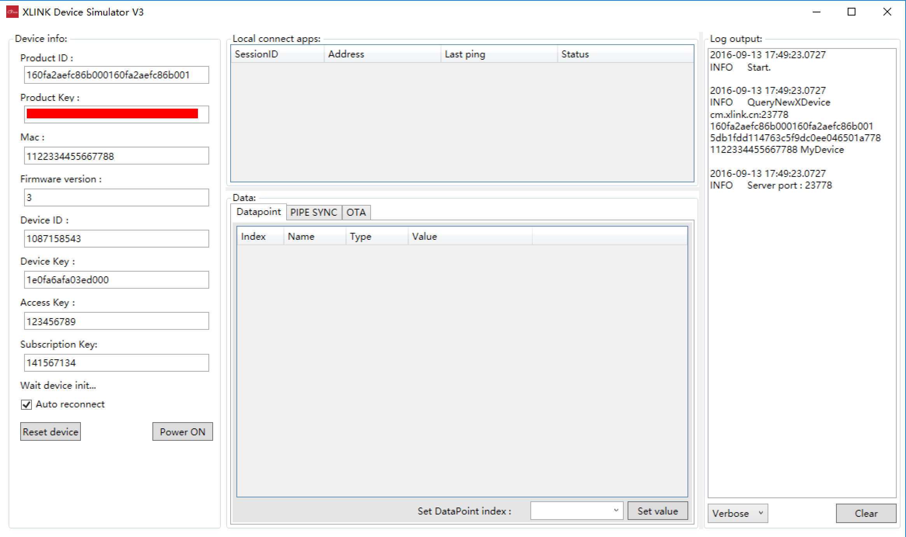
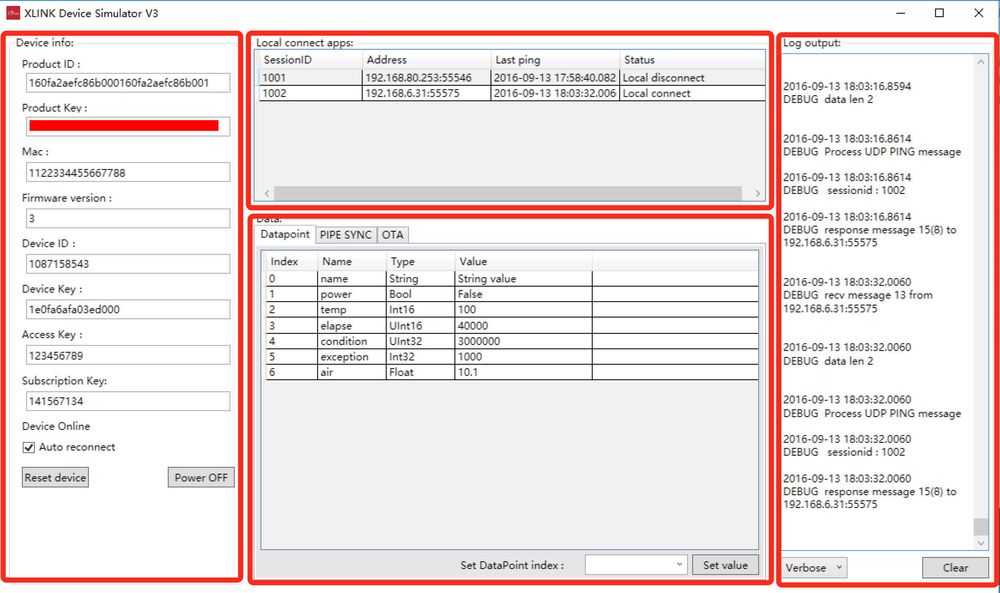
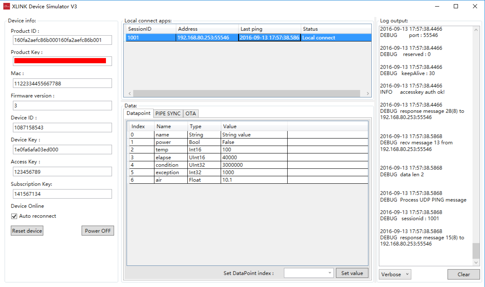
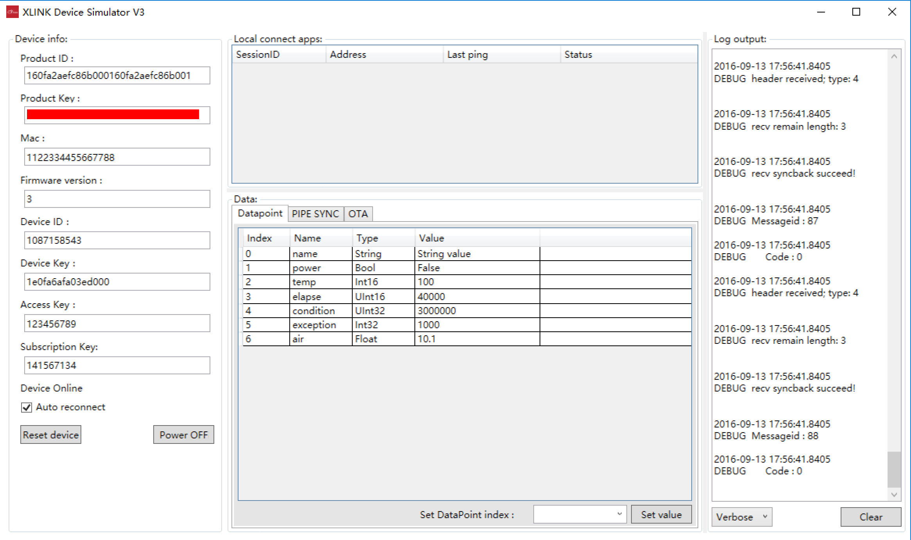
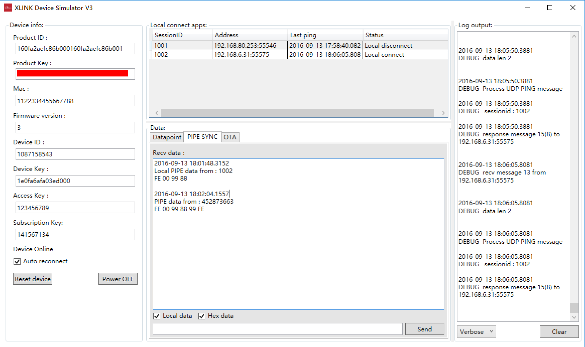
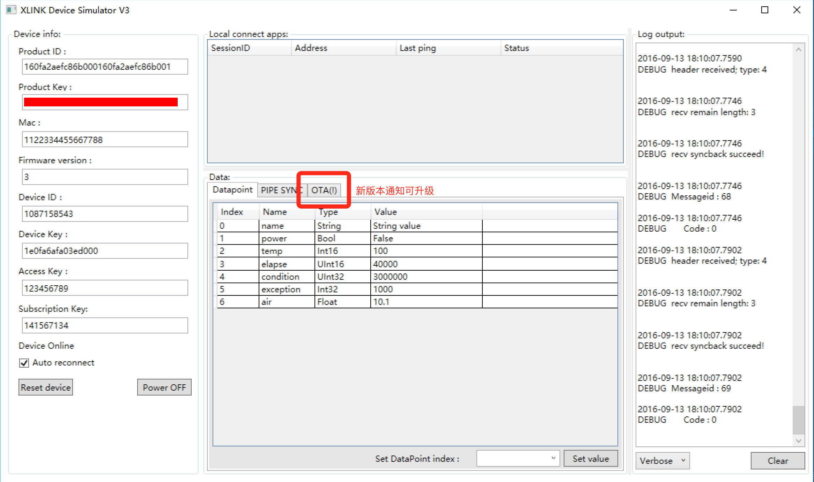
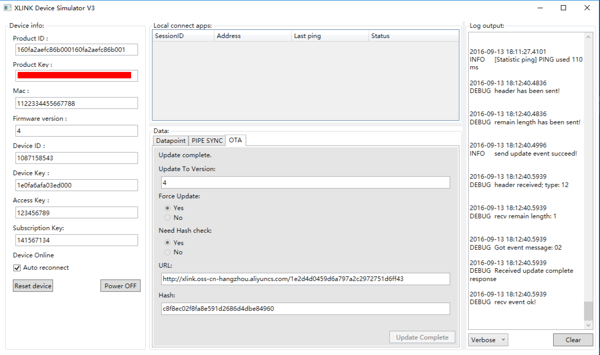

# XLINK设备模拟器(v3)使用说明

## 概要

* XLINK设备模拟器是一个Windows应用程序，用来模拟XLINK设备的通讯功能，特别是验证与测试XLINK设备通讯协议，包括局域网内的通讯协议和云端的通讯协议；
* 局域网通讯主要包括：
	1. 设备发现；
	2. 局域网内握手认证；
	3. 局域网内数据透传；
	4. 局域网内数据端点控制与通知；
* 云端通讯主要包括：
	1. 设备激活；
	2. 连接登录；
	3. 设备订阅；
	4. 云端数据透传；
	5. 云端数据端点控制与通知； 
	6. 模拟固件升级；
* XLINK设备模拟器可以配合APP程序，模拟和验证设备通讯协议以及控制功能；

### 文件包

* XLINK设备模拟器为绿色软件，包括下列5个文件。
	1. **Newtonsoft.Json.dll**：JSON解析库； 
	2. **Newtonsoft.Json.xml**: JSON解析库配置文件；
	3. **WpfXDeviceEmu.exe**: 模拟器主程序；
	4. **WpfXDeviceEmu.ini**: 模拟器配置文件；
	5. **XLinkDeviceLib.dll**: XLINK模拟器核心库；

### 运行环境

* XLINK模拟器采用微软.Net 4.0框架开发；需要依赖于微软.Net 4.0运行环境；
	* .Net 4.0 framework下载地址: [https://www.microsoft.com/zh-CN/download/details.aspx?id=17718](https://www.microsoft.com/zh-CN/download/details.aspx?id=17718)
* XLINK模拟器在Windows Vista以上运行良好，不建议使用在Windows XP上使用；不支持Windows XP以下系统；
* XLINK模拟器支持32位Windows环境和64位Windows环境；

## 启动和使用

### 1. 安装微软.Net 4.0框架

* 再次说明模拟器程序是采用.Net 4.0框架实现，请先安装微软.Net 4.0运行环境；

### 2. 配置程序

* WpfXDeviceEmu.ini中包含了程序运行的基本环境的配置，如下：
	
```
[Application]
ApiHost=http://api.xlink.cn
ServerHost=cm.xlink.cn:23778

[Product]
ProductID=160fa2aefc86b000160fa2aefc86b001
ProductKey=5db1fdd114763c5f9dc0ee996599a778
MAC=1122334455667788	
```

条目 | 说明 
--- | ---
ApiHost | 程序访问Restful接口的地址，SaaS版本不用进行配置，私有云环境请配置成为对应的访问地址；
ServerHost | 程序连接CM服务器地址，SaaS版本不用进行配置，私有云环境请配置成为对应的访问地址；
ProductID | 预置的产品ID，请开发人员自行设置；
ProductKey | 预置的产品Key，请开发人员自行设置；
MAC | 模拟设备的MAC地址，必须使用已经添加到管理台，进行了预授权的设备的MAC地址；

### 3. 运行程序

* 运行WpfXDeviceEmu.exe程序，弹出程序主界面：

### 4. 使用

* 设备模拟器分为4大区域：Device info、Local connect Apps、Data以及Log output：


#### 1. Device info:

* Device info区域用来描述和设置设备的基本信息，包括ProductID，ProductKey和模拟设备MAC地址；
* **Firmware Version**: 设备模拟器模拟的固件版本，从1开始。每次Reset设备，版本会重置为1。
* **Device ID**：在激活后，在这里会显示设备ID；
* **Access Key**：在APP内网发现并且设置了AccessKey以后，这里会显示设置的AccessKey，模拟器程序会保存设置的AccessKey，下次程序启动后可继续使用。
* **Subscription Key**，简称SubKey，在模拟器被APP设置了AccessKey时自动生成，会显示在Subscription Key区域，并且也会保存下来，下次启动模拟器程序还可继续使用。
* **Auto reconnect**，选中后，当程序与云端断开后，会自动重新连接。 
	* **注意：** 每次与云端连接断开的同时，也会断开局域网内已经和模拟器连接的APP，APP需要重新与模拟器进行内网认证连接后方可再次进行内网通讯；
* **Reset Device**：当改变了ProductID，ProductKey或MAC地址后，需要Reset device方可生效；
	* **注意：** Reset Device会断开设备与云端的连接；
* **Power ON**：模拟器启动，开始内网通讯监听，连接云端；成功与云端连接后，按钮会变为Power OFF，点击Power OFF会模拟设备断电的动作，与云端的通讯会断开，同时内网通讯也会断开。
	
#### 2. Local connect apps:

* 通过内网发现以及内网通讯连接上来的APP，会在这里显示，如图：
* 显示内容包括
	* 1. Session ID;
	* 2. APP的IP和端口;
	* 3. APP与设备最后一次心跳时间;
	* 4. APP与设备的连接状态，Local connect/Local disconnect;

#### 3. Data:

* Data区域用来显示和模拟数据通讯功能，包括DataPoint（数据端点）的显示和设置，PIPE SYNC（透传数据的）接收显示和发送；
* **DataPoint：**
	* 在管理台如果配置了该产品的数据端点列表，那么模拟器在激活和连接到云端以后，会自动去获取该产品的数据端点列表，如图：
	* 双击某个条目，在下方的输入区域输入数据，点击Set value，便可设置该数据端点，同时模拟器会在内网和云端通知该数据端点的变化，内网APP和云端都会收到该消息；
	* 如果APP和云端对该设备的数据端点进行了设置，界面上的条目也会产生相应的变化；
* **PIPE SYNC:**
	* 用来显示设备接收到的云端透传数据以及局域网内的透传数据，如图：
	* 在下方的输入框输入内容，并且点击Send，也可以进行透传数据的发送， **注意：该版本的模拟器暂时只支持PIPE SYNC，也就是透传数据的广播发送，暂时还不支持针对某个APP的透传数据的发送。**
	* 在发送透传数据的时候，模拟器支持通过内网发送透传数据（ **选中Local data** ），也支持用户输入16进制数据进行发送（ **选中Hex data** ）；
* **OTA**
	* OTA区域用来显示设备模拟器从云端获取到的OTA信息，以及模拟升级完成升级任务，并且上报升级结果。
	* 设备模拟器上线后，若云端有针对该设备的升级信息，模拟器会收到云端的推送消息，并且显示在OTA的Tab中（且Tab名会变成 **OTA(!)** )，如图：
	* 进入OTA Tab，可以看到OTA的相关信息，包括固件文件下载地址，hash值，以及相关参数，如图：用户可以点击 **"Update Complete"** 按钮，模拟设备升级后的动作，平台会收到设备升级完成消息，并且更新云端的设备版本信息。
	* 完成升级后界面的变化：若通讯正常，模拟器再次上线，将不会再收到OTA消息。若需要再次测试OTA的功能，可以使用 **"Reset Device"** 功能，将设备重置为版本1。

#### 4. Log output:

* 设备模拟器运行日志显示区域；
* **Clear**按钮用来清除日志；
* **日志级别下拉框**用来过滤需要显示的日志级别。 **注意：该功能暂只能过滤新来的日志，已经显示的日志不会过滤掉。**

## 关于模拟器的二次开发

* XLINK设备模拟器是XLINK针对Windows下XLINK设备SDK的一个应用实现，XLINK可以提供Windows下的设备SDK，厂商可以根据自己的需求对设备模拟器进行二次开发。
* XLINK设备模拟器采用.Net制作，也是为了方便厂商能够快速的进行二次开发，XLINK可以提供设备模拟器的工程源码，厂商可以作为参考，也可在源码工程上直接进行修改。