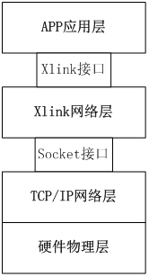
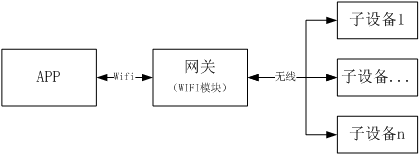
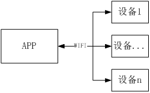

©2016  **云智易**物联云平台（http://www.xlink.cn）

# 嵌入式SDK介绍

云智易物联硬件接口主要为传统厂商的产品接入互联网，并能通过APP对产品进行监测、控制和统计等。

## 1.主要特点
* 本地设备自动探测和扫描联网；
* 内置云端连接服务，无需额外对接开发；
* 支持内、外网网络自动检测和切换；
* 提供云端固件升级和远程配置、诊断和管理服务；
* 支持设备安全认证和数据加密机制；
* 支持微信Air Kiss、SmartLink和easylink一键配置；
* 支持ARM、x86、x64以及MIPS等不同处理器架构；
* 可移植性强，使用操作简单快捷。

## 2.Xlink SDK结构

结构图如下：

## 3.相关概念说明
### 3.1集成模式

集成模式主要有两种，分别为C语言接口和串口模式。

#### 3.1.1 C语言接口

C语言接口通常为提供静态库，直接在模组或芯片上开发应用程序，快速通过相应API接口将设备接入到云平台。

## 3.2.2 串口模式

串口模式通常为提供Wifi模组或芯片的串口通讯固件，外部MCU通过串口连接到Wifi模组或芯片，通过“设备通讯协议”来完成联网及控制。

### 3.2单品和网关模式

#### 3.2.1 网关模式
网关模式，由一个网关设备和一个或多个子设备组成的有线或无线局域网，并可通过网关进行管理和控制。

#### 3.2.2 单品模式
单品模式，由一个或多个设备直接通过wifi网络连接到路由器组成的无线网络。

©2016  **云智易**物联云平台（http://www.xlink.cn）
